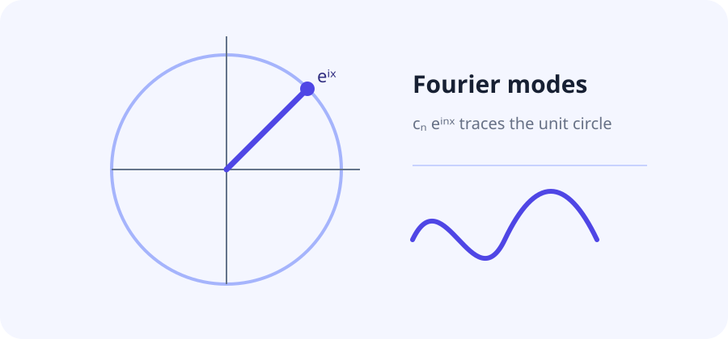

# 傅里叶级数

## 定义

\begin{definition}{def:fs}[傅里叶级数]
设 $f$ 是 $2\pi$ 周期函数，其傅里叶级数为
$$ f(x) \sim \sum_{n=-\infty}^{\infty} c_n e^{inx}, \quad c_n = \frac{1}{2\pi}\int_{-\pi}^{\pi} f(x)e^{-inx}\,dx. \label{eq:coef} $$
\end{definition}

## 收敛性

\begin{theorem}{thm:dirichlet}[Dirichlet 定理]
若 $f$ 分段光滑，则其傅里叶级数逐点收敛于 $\frac{f(x^+)+f(x^-)}{2}$，系数如 \eqref{eq:coef} 所示。
\end{theorem}

\begin{proof}
由 Dirichlet 核的卷积表示与 \autoref{def:fs} 中部分和的定义直接推得。
\end{proof}

## 矩阵形式

$$ D = \left( e^{ikx_j} \right)_{k,j=1}^{N} = \begin{pmatrix} 1 & 1 & 1 \\ 1 & \omega & \omega^2 \\ 1 & \omega^2 & \omega^4 \end{pmatrix} $$

其中 $\omega = e^{-2\pi i/N}$。



经典的收敛性论述可参见 \cite{duoandikoetxea2001}；这里用它作为文内引用与自动参考文献生成的测试样例。

延伸阅读：[[banach-fixed-point]]

```bibtex
@book{duoandikoetxea2001,
  author = {Javier Duoandikoetxea},
  title = {Fourier Analysis},
  publisher = {American Mathematical Society},
  year = {2001}
}
```

> 更多内容见「Banach 不动点」一文。
