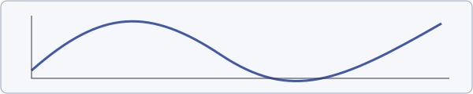

## 公式、定理与引用

这份文档检查中文、英文以及数学公式的打印结果。See \autoref{thm:energy}
and \eqref{eq:energy}; a reference appears in the proof \cite{example}.

\begin{theorem}{thm:energy}[能量恒等式]
设 $u$ 足够光滑，且满足齐次 Dirichlet 边界条件，则
$$
\frac{1}{2}\frac{\mathrm{d}}{\mathrm{d}t}\int_\Omega u^2\,\mathrm{d}x
+\int_\Omega |\nabla u|^2\,\mathrm{d}x=0.\label{eq:energy}
$$
\end{theorem}

\begin{proof}
将方程乘以 $u$ 后积分，再使用分部积分。参见 \cite{example}。
\end{proof}

## 表格与代码

| 项目 | Expected result |
| --- | --- |
| 中文正文 | 清晰、可选择、可搜索 |
| 数学公式 | 完整显示，上下标不被裁切 |
| 交叉引用 | PDF 内部跳转 |

```python
def energy(values):
    # A long line must wrap instead of disappearing beyond the printable area.
    description = "This is an intentionally long source line used to check that PDF export wraps code correctly without clipping any characters at the right margin of the printed page."
    return sum(value * value for value in values)
```

## 本地插图



## 参考资料

[Playwright PDF API](https://playwright.dev/python/docs/api/class-page#page-pdf)

```bibtex
@book{example,
  author = {Example Author},
  title = {Energy Methods},
  year = {2026}
}
```
